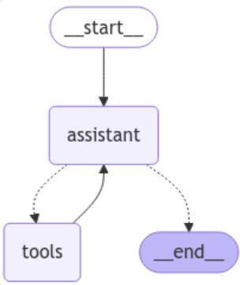
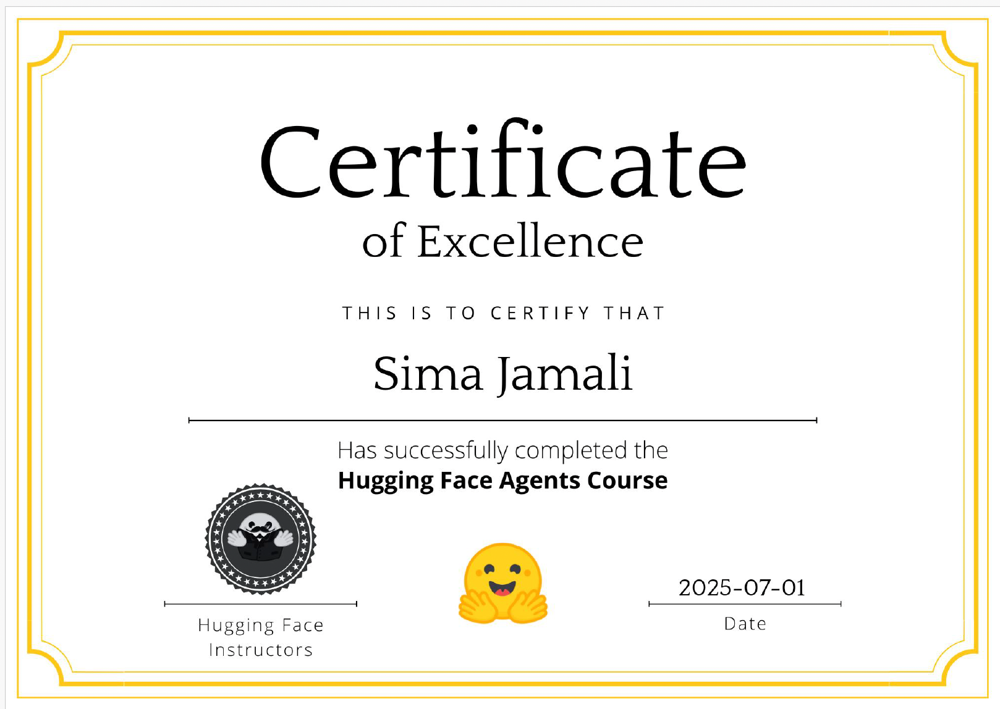

# LangGraph AI Agent for the GAIA Benchmark (HuggingFace AIAgents Course Capstone)

This capstone project for the Hugging Face Agents course builds an advanced AI agent capable of solving real-world tasks in the GAIA benchmark, a demanding suite that probes reasoning, multimodal understanding, web browsing, and complex tool use.

Powered by LangGraph, the agent is tuned for a curated set of 20 Level-1 validation questions, combining multiple specialized models and tools to deliver accurate, conversational answers.

### The GAIA Benchmark :
GAIA (General AI Assistant) is a 466-question benchmark that probes AI agents on real-world tasks requiring multi-step reasoning, multimodal understanding, web search, and tool use; humans answer about 92 % correctly, while GPT-4 with plugins manages roughly 15 %.

## Model Selection

Hybrid model strategy to optimize performance, cost-efficiency, and reliability:

1. `gpt-4.1-mini` is the Primary orchestrator. A multimodal model that ingests text, images, and audio, it excels at high-level reasoning and tool chaining. Delivered through the OpenAI API, it offers fast and accurate performance for the manager agent.

2. `gemini-flash 2.0` is a lightweight side-kick used in assistant agent. Handles simpler, high-volume tool calls so the main model stays responsive and well within rate limits, reducing overall latency and quota consumption. Delivered through the Google Generative AI API (with a generous free tier)

## Tools

The model have access to use multiple tools (prebuilt and costum). Tools are mainly used for web scraping, Wikipedia and YouTube search, audio processing, and understanding chess moves.

## Environment Variables

These API keys are required:
1. OPENAI_API_KEY
2. GOOGLE_API_KEY 
3. TAVILY_API_KEY

## Agent Architecture

## Project Summary & Reflections
This project was the capstone of the Hugging Face AI Agents Course, and easily one of the most rewarding challenges I’ve taken on. I ended with a 55% exact-match accuracy, and while not perfect, the process gave me deep insight into the realities of building agentic systems.
The process envoled a lot of experimenting with different models and tools, and iterating on designs to hit the right balance between control and flexibility. My initial attempt used smol-agents for its simplicity, but the lack of control and unpredictability in agent behavior quickly became a blocker. I pivoted to LangGraph, whose graph-based structure let me build a clear, stateful ReAct style loop that was easier to debug and extend.

### Model Selection and Tradeoffs
Choosing the right LLM proved to be one of the most critical parts given its effect on the answers. I started with Gemini 2.0 Flash—fast and accessible via Google’s free tier—but it often failed at following instructions and struggled with tool use. I later moved to GPT-4.1-mini, which offered more consistent tool usage and reasoning, though still showed surprising variability even at temperature 0. GPT-4.o-mini showed similar srength. I also tried the newer OpenAI model accessible through APIs, GPT-4.1, which showed the best results (about 80% accuracy) but it still has limits on number of tokens per minute which made it not ideal to use. 

### Tools
Early in the project, I realized I had to be selective with tool usage. Adding too many tools often introduced more points of failure—especially when they produced conflicting outputs. I experimented with various web search tools (like DuckDuckGo and Tavily) and found that Tavily consistently delivered more relevant and useful results. I also discovered the importance of building custom tools to compensate for model limitations. For instance, a dedicated chess tool became essential, as the models I used struggled to interpret chess board images reliably.

### Lessons Learned and challenges:
- LLM power is critical: a better model can often replace sophisticated logic.
- Exact-match grading is challenging: answers that were semantically correct but phrased differently still failed as the benchmark requires specific formatted answers. System Prompts became very important in handling this challenge.
- Tool cascades: A single weak tool output could derail the entire answer chain. It's often better to be selective with the tools. Also web searches can be inconsisent and result in different answers, leading to failures. 

## Final Thoughts
I gained something valuable from this project: hands-on experience in building practical, tool-augmented AI agents that work under real-world constraints. The project stretched my understanding of LLMs, reinforced the importance of infrastructure and tracing, and left me more excited than ever to keep exploring this fast-evolving space.

